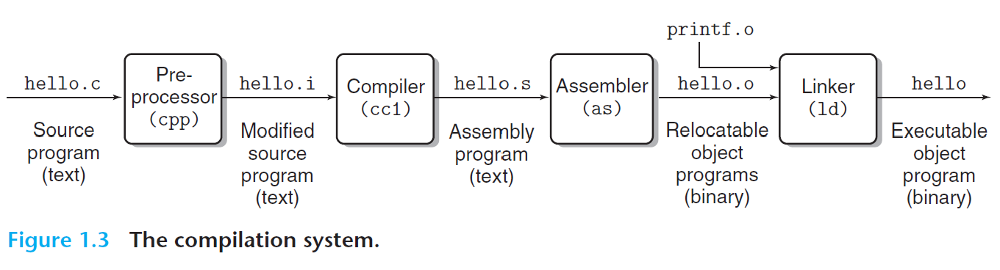
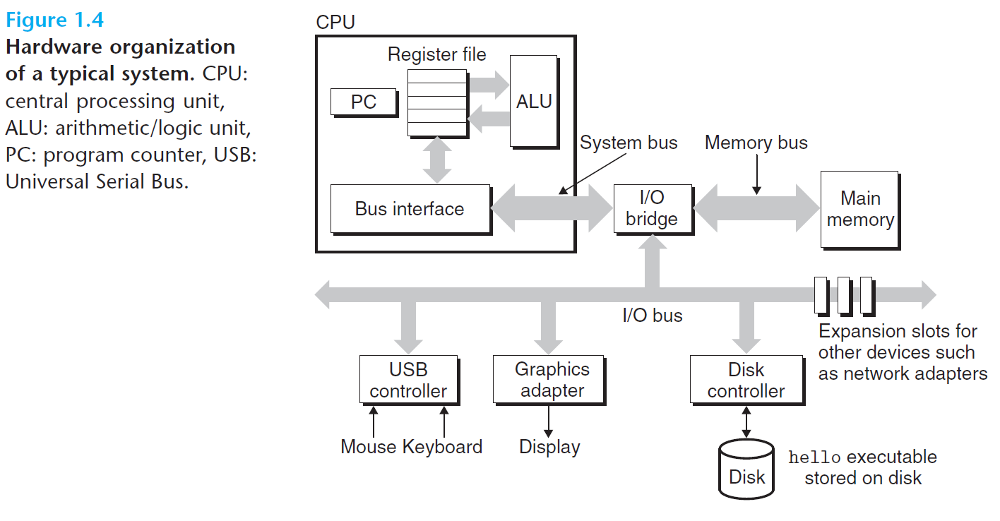
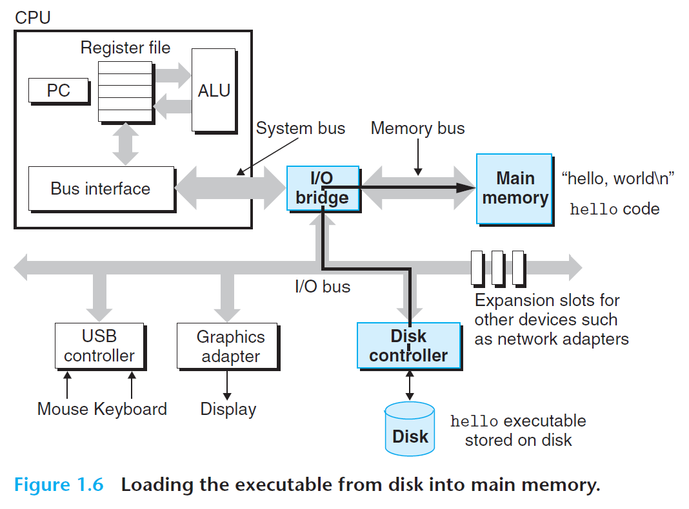
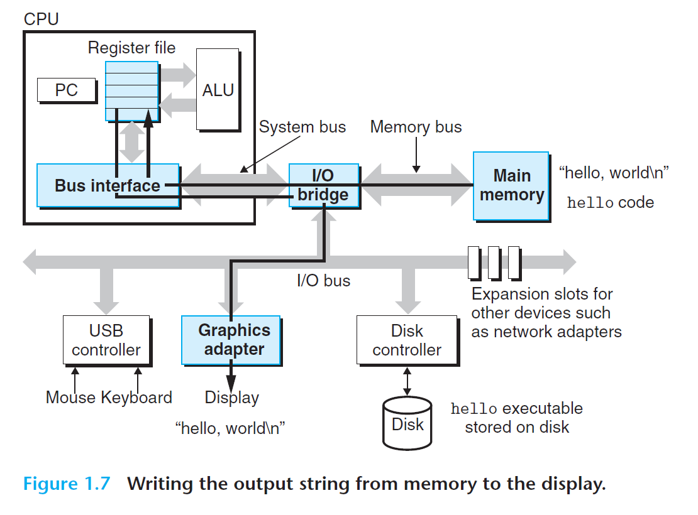
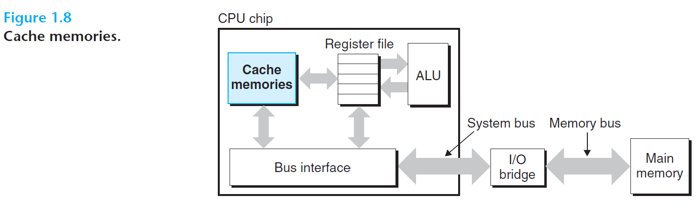
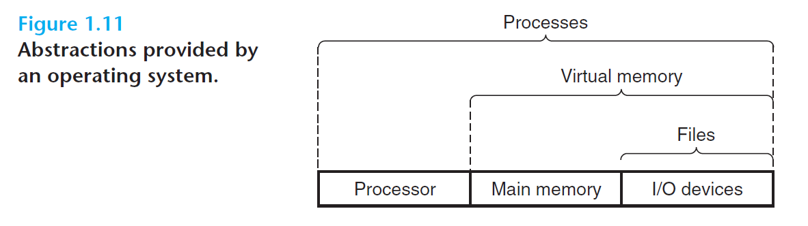
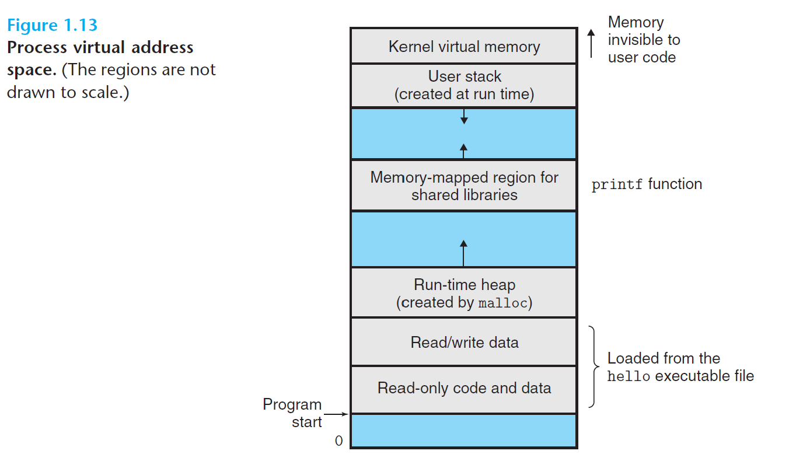
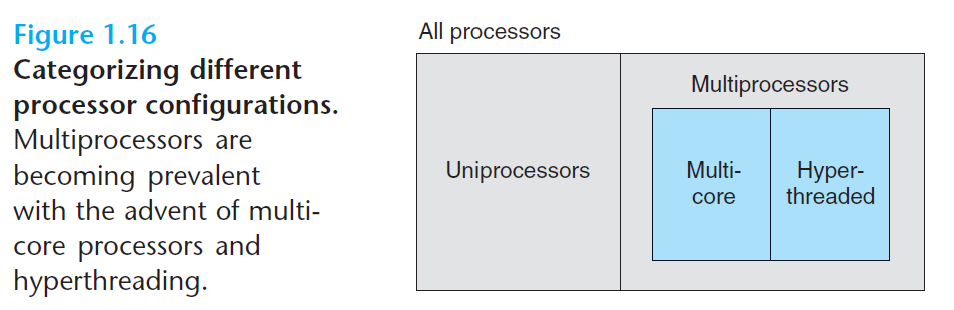
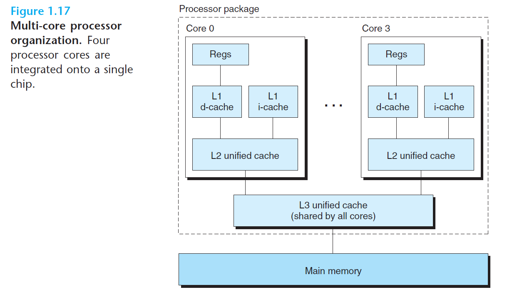
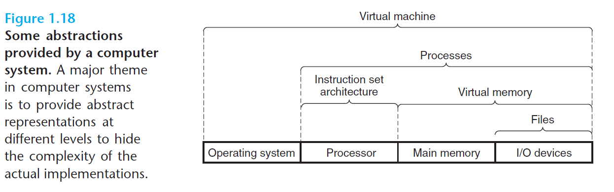

# A Tour of Computer Systems

- 1.1 Information Is Bits + Context 
- 1.2 Programs Are Translated by Other Programs into Different Forms
- 1.3 It Pays to Understand How Compilation Systems Work
- 1.4 Processors Read and Interpret Insttructions Stored in Memory
- 1.5 Caches Matter 
- 1.6 Storage Devices From a Hierachy
- 1.7 The Operatin System Manages the Hardware
- 1.8 Systems Communicate with Other Systems Using Networks
- 1.9 Important Themes
- 1.10 Summary
- Bibliographic Notes
- Solutions to Practice Problems

 

Word list
- craft 工艺 手艺 工艺品 飞船
- craft brother 同行
- art and craft 工艺品
- space craft 宇宙飞船
- craft design 工艺美术设计
- craft paper 牛皮纸
- landing craft 登陆艇
- air craft 飞机 航空器
- by craft 用诡计（手腕）
- poise 姿势 平衡 镇静 使平衡 保持...姿势 
- be poised for 可能
- enlithten 启发 开导
- numerical 数字的 数值的
- numerical simulation 数值模拟
- numerical control 数字控制
- numerical analysis 数值分析
- numerical method 数值方法
- numerical calculation 数值计算
- numerical control machine 数控机床
- exploit 开发 开拓 剥削 利用
- plague 瘟疫 感染瘟疫
- nasty 下流的 肮脏的 主要指特别讲究清洁的人感到讨厌的东西
- confound 使惊惶 弄糊涂
- promise 希望 承诺
- pitfall 陷阱
- in a sense 某种意义上
- terminology 术语
 

## 1.1 Information Is Bits + Context

WordList
- approximation 近似值
 

## 1.2 Programs Are Translated by Other Programs into Different Forms

| FORM | FILE NAME | FILE TYPE                  | FROM WHERE | SHORTCUT |
| ---- | ----      | ----                       | ----       | ----     |
| text | hello.c   | source program             | man write  | man |
| text | hello.i   | modified source program    | Pre-processor | cpp  |
| text | hello.s   | assembly program           | Compiler | cc1 |
| binary | hello.o | relocatable object program | Assembler | as |
| binary | hello   | executable object program  | Linker    | ld |

**FIGURE 1.3**   The compilation systems  

linux> gcc -o hello hello.c

The programs that perform the four phases (preprocessor, compiler, assembler, and linker) are known collectively as the compilarion system.

Word list
- executable object program = executable object file 可执行对象文件
- collectively 集体地 全体地 共同地
- gibberish 历任费解的话 晦涩的文字 乱码
 

Four phases
- Preprocessing phase. (.c to .i) (modify source code)
- Compilation phase. (.i to .s) (modified code to assembly code)
    - Assembly language is useful because it provides a common output language for different compilers for different high=level languages.
        - For example, C and Fortran compilers both generate output files in the same assembly language.
- Assembly phase. (.s to .o) (assembly code to relocatable object file)
    - The assembler (as) translates .s into machine-language instructions, package them in a form known as relocatable object program, and stores the result in the object file .o. 
        - This file is a binary file containing 17 bytes to encode the instructions for function main.
        - If we were to view hello.o with a text editor, it would appear to be gibberish.
- Linking phase. (hello.o to hello) (relocatable object file to excutable)
    - linking printf.o and hello.o

## 1.3   It Pays to Understand How Compilation Systems Work

Reasons why programmers need to understand how compilation systems work:
- *Optimizing porgram performance.* 
- *Understanding link-time errors.*
- *Avoiding security holes.*
    - A first step in learning secure programming is to understand the consequences of the way data and control information are stored on the program stack.
    - We will also learn about methods that can be used by the programmer, compiler, and operating system to reduce the threat of attack.

Word List
- incur 招致 引发 蒙受
- perplexing 令人困惑的 令人费解的
- buffer overflow 缓冲区溢出

## 1.4    Processors Read and Interpret Instructions Stored in Memory

To run the executable file on a Unix system, we type its name to an application program known as a *shell*:

linux> ./hello  
hello, world  
linux>  

The shell is a command-line interpreter that prints a prompt, wait for you to type a command line, and then performs the command.
    - If the first word of the command line does not correspond to a built-in shell command, hen the shell assumes that it is the name of an executable file that it should load and run.
    - So in this case, the shell loads and runs the hello program and hen waits for it to terminate.
    - The hello program prints its message to the screen and hen terminates.
    - The shell then prints a prompt and waits for the next input command line.

Word List
- prompt 敏捷迅速的 立即的 促进 提示 激起 提示符 
- prompt delivery 限时专送
- command prompt 命令提示符
- prompt attention 从速办理
- prompt payment 立即付款
- voice prompt 语音提示
- prompt shipment 即期装船
- prompt in 对...很迅速

### 1.4.1    Hardware Organization of a System

We will get to HOTS's (the Harware Organization of a Typical System) various details in stages throughout the course of the book.

Word List
- in stages 在不同的阶段 循序渐进的意思
- stage 阶段
- course 进程 过程 航向 航线 
- conduits 导管 导水管 沟渠
- chunk 大块 矮胖的人或物
- lexical chunks 词汇版块 语块
- file 公文箱 卷宗 文件夹 纵列 档案

#### Buses
Running throughout the system is a collection of electrical conduits called buses that carry bytes of information back and forth between the components.
Buses are typically designed to transfer fixed-size chunks of bytes known as *words*.
The number of bytes in a word (the *word size*) is a fundamental system parameter that varies across systems. 
Most machines today have word size of either 4 bytes (32 bits) or 8 bytes （64 bits）. 
In this book, we do not assume any fixed definition of word size. Instead, we will specify what we mean by a "word" in any context that requires this to be defined.

#### I/O Devices

keyboard, mouse
display
disk drive 磁盘驱动器

Word list
- initially 最初
- reside  住在
- chipset 芯片集 芯片组
- regardless 不管 不管怎样

Each I/O device is connected to the I/O bus by either a *controller* or an *adapter*.
The distinction between the two is mainly one of packaging.
Controllers are chipsets in the device itself or on the system's main printed circuit board (often called the *motherboad*).
An adapter is a card that plugs into a slot on the motherboad.
Regardless, the purpose of each is to transfer information back and forth between the I/O bus and an I/O device.

#### Main Memory
The *main memory* is a temporary storage device that holds both a program and the data it manipulates while the processor is executing the program.
Physically, main memory consists of a collection of *dynamic random access memory* (DRAM) chips.
Logically, memory is organized as a linear array of bytes, each with its own unique address (array index)
starting at zero.
In general, each of the machine instructions that constitute a program can consist of a variable number of bytes.
The sizes of data items that correspond to C program variables vary according to type.
For example, on an x886-64 machine running Linux, data of type short require 2 bytes, types int and float 4 bytes, and types long and double 8 bytes.

Wordlist
- constitute 构成
- interpret 解释 说明
- dictate 口授 指示 指令 命令 要求 规定
- contiguous 接近的 接触到 邻近的 共同的
- revolve 使旋转 围绕...转动 以...为中心

#### Processor

The *central processing unit* (CPU), or simply *processor*, is the engine that interprets (or *executes*) instructions stored in main memory.
At its core is a word-size storage device (or *register*) called the *program counter* (PC). 
At any point in time, the PC points at (contains the address of) some machine-language instruction in main memory.

From the time that power is applied to the system until the time that the power is shut off, a processore repeatedly executes the instruction pointed at by the program counter and updates the program counter to point the next instruction.
A processor *appears* to operate according to a very simple instruction execution model, defined by its *instruction set architecture*. 
In this model, instructions execute in strict sequence, and executing a single instruction involves performing a series of steps.
The processor reads the instruction from memory pointed at by the program counter (PC), interprets the bits in the instruction, performs some simple opration dictated by the instruction, and then updates the PC to point to the next instruction, which may or may not be contiguous in memory to the instruction that was just executed.

There are only a few of these simple operations, and they revolve around main memory, the *register file*, and the *arithmetic/logic* unit (ALU).
The register file is a small storage device that consists of a collection of word-size registers, each with its own unique name.
The ALU computes new data and address values.
Here are some examples of simple operations that the CPU might carry out at the request of an instruction:

- *Load:* Copy a byte or a word from main memory into a register, overwriting the previous contents of the register.
- *Store:* Copy a byte or a word from a register to a location in main memory, overwriting the previous contents of that location.
- *Operate:* Copy the contents of two registers to the ALU, perform an arithmetic operation on the two words, and store the result in a register, overwriting the previous contents of that register.
- *Jump:* Extract a word from the instruction itself and copy that word into the program counter (PC), overwriting the previous value of the PC.

We say that a processor appears to be a simple implementation of its instruction set architecture, but in fact modern processors use far more complex mechanisms to speed up program execution.
Thus, we can distinguish the processor's instruction set architecture, describing the effect of each machine-code instruction, from its *microarchitecture*, describling how the processor is actually implemented.
When we study machine code in Ch3, we will consider the abstraction provided by the machine's instruction set architecture.
Ch4 has more to say about how processsors are actually implemented.
Ch5 describes a model of how modern processors work that enables predicting and optimizing the performance of machine-language programs.

### 1.4.2    Running the hello Program

Given this simple view of a system's hardware organizaition and operation, we can begin to understand what happens when we runour example program.
We must omit a lot of details here taht will be filled in later, but for now we will be content with the big picture.

Initially, the shell program is executing its instructions, waiting for us to type a command.
As we type the characters "./hello" at the keyboard, the shell program reads each one into a register and then stores it int memory, as shown in Figure 1.5.

When we hit the enter key on the keyboard, the shell knows that we have finished typing the command. 
The shell then loads the executable "hello" file by executing a sequence of instructions that copies the code and data in the object file from the disk to main memory.
The data includes the string of characters "hello, world\n" that will eventually be printed out.

Using a technique known as *direct memory access* (DMA, discussed in Ch6), the data travel directly from disk to main memory, without passing through the processor.
This step is shown in Figure 1.6.

Once the code and data in the "hello" object file are loaded into memory, the processor begins executing the machine-language instructions in the "hello" program's "main" routine.
These instructions copy the bytes in the "hello, world\n" string from memory to the register file, and from there to the display device, where they are displayed on the screen. 
This step is shown in Figure 1.7.

## 1.5 Caches Matter

Disk minght be 1000 times larger than the main memory. It might take the processor 10M times longer to read a word from disk than from memory.

Register file might only a few hundred bytes, as opposed to billions of bytes in memory.
However, the CPU can read data from register file almost 100 times faster than from memory.

Even more troublesome, as semiconductor technology progresses over the years, this *processor-memory gap* continues to increase. It is easier and cheaper to make processor run faster than it is to make main memory run faster.

| Component | Speed | Size(bytes) |
|--|--|--|
| Register file | 1/100 | hundreds |
| Memory | 1 | billions (4GB ~= 4 billions) |
| Disk | 10,000,000 | 1000 times of MEM |

To deal with the processor-memory gap, system designers include smaller, faster storage devices called *cache* memories (or simply caches) that serve as temporary staging areas for information that the processor is likely to need in the near future.

Figure 1.8 shows the cache memories in a typical system.

An *L1 cache* on the processor chip holds tens of thousands of bytes and can be accessed nearly as fast as the register file.   

An larger *L2 cache* with hundreds of thousands to millions of bytes is connected to the processor by a special bus.

It might take 5 times longer for the processor to access the L2 cache than the L1 cache, but this is still 5 to 10 times faster than accessing the main memory.   

The L1 and L2 caches are implemented with a hardware technology known as *static random access memory* (SRAM).   

Newer and more powerful systems even have three levels of cache: L1, L2, and L3.  

The idea behind caching is that a system can get the effect of both a very large memory and a very fast one by exploiting *locality*, the tendency for programs to access data and code in localized regions.  

By setting up caches to hold data that are likely to be accessed often, we can perform most memory operations using the fast caches.  
 

One of the most important lessons in this book is that application programmers who are aware of cache memories can exploit them to improve the performance of their programs by an order of magnitude. You will learn more about these important devices and how to exploit them in Ch6.

Wordlist
- exploit 强调充分利用

## 1.6 Storage Devices Form a Hierarchy

## 1.7 The Operatin System Manages the Hardware

No apps accessed the keyboard, display, disk, or memory directly. Rather, they relied on the services provided by the *operatin system*. We can think of the OS as a layer of software interposed between (插入) the app program and the hardware, as shown in Figure 1.10. All attempts by an app to manipulate the hardware must go throuth the OS.

The OS has 2 primary purposes:
1. to protect the hardware from misuse by runaway apps and
2. to provide apps with simple and uniform mechanisms for manipulating complicated and often wildly different low-level hardware devices.

The OS achieves both goals via the fundamental abstractions shown in Figure 1.11: *processes*, *virtual memory*, and *files*. As this figure suggests, *files* are abstractions for I/O devices, *virtual memory* is an abstraction for both the main memory and disk I/O devices, and *processes* are abstractions for the processor, main memory, and I/O devices. We will discuss each in turn(轮流 in turn).

### 1.7.1   Processes

When a app program such as "hello" run on a modern system, the OS provides the illusion that the program is the only one runing on the system. The program appears to have exclusive use of both the processor, main memory, and I/O devices. The processor appears to execute the instructions in the program, one after the other ,without interruption. And the code and data of the program appear to be the only objects in the system 's memory. These illusions are provided by the notion (观念 概念) of a process, one of the most important and successful ideas in CS.

A *process* is the OS's abstraction for a running program.Multiple processes can run concurrently onthe same system, and each process appears to have exclusive use of the hardware. By *concurrently*, we mean that the instructions of one process are interleaved (交错进行的) with the instructions of another process. In most systems, there are more processes to run than there are CPUs to run them.

Word list
- dub 授予称号 配音 轻点 打击 n->本地 鼓声
- pun 双关语 俏皮话
- vendor 卖主 小贩 自动售货机 供应商 销售商
- simultaneously 同时地

Traditional system could only execute one program at a time, while newer *multi-core* processors can execute several programs simultaneously. In either case, a single CPU can appear to execute multiple multiple processes concurrently by having the processor switch among them. The OS performs this interleaving with a mechanism known as *context switching*. To simplify the rest of this discussion, we consider only a *uniprocessor system* containing a single CPU. We will return to the discussion fo *multiprocessor* systems in Section 1.9.2.

The OS keeps track of all the state info that the process needs in order to run. This state, which is known as the *context*, includes info such as the current values of the PC, the register file, and the contents of main memory. At any point in time, a uniprocessor system can only execute the code for a single process. When the OS decides to transfer control from the current process to some new process, it performs a *context switch* by saving the context of the current process ,restoring (恢复) the context of the new process, and then passing control to the new process. The new process picks up exactly where it left off. Figure 1.12 shows the basic idea for our example "hello" scenario.

There are two concurrent processes in our example scenario: the shell process and the hello process. Initially, the shell process is running alone, waiting for input on the command line. When we ask it to run the hello program, the shell cariies out our request by invoking (调用) a special function known as a *system call* that passes control to the OS. The OS saves the shell's context, creates a new hello process and its context, and then passes control to the new hello process. After hello terminates, the OS restores the context of the shell process and passes control back to it, where it waits for the command-line input.

As Fig1.12 indicates, the transition from one process to another is managed by the OS *kernel*. The kernel is the portion of the OS code that is always resident in memory. When an app program requires some action by the OS, such as to read or write a file, it executes a special *system call* instruciton, transferring control to the kernel. The kernel then performs the requested operatin and returns back to the app program. Note that the kernel is not a separate process. Instead, it is a collection of code adn data structures that the system uses to manage all the processes.

Implementing the proces abstraction requires close cooperatin between both the low-level HW and the OS SW. We will explore how this works, and how app can create and control their own processes in Ch8.

### 1.7.2   Threads

Although we normally think of a process as having a single control flow, in modern systems a process can actually consist of multiple execution units, called *threads*, each running in the context of the process and sharing the same code and global data. Threads are an increasingly important programming model because of the requirement for concurrency in network servers, because it is easier to share data between multiple threads than between multiple processes, and because threads are typically more effcient than processes. Multi-threading is also one way to make programs run faster when multiple processor are available, as we will discuss in Section 1.9.2. you will learn the basic concepts of concurency, including how to write threaded programs, in chapter 12.

### 1.7.3    Virtual Memory

*Virtual Memory* is an abstraction that provides each process with the illusion that it has exclusive use of the main memory. Each process has the same uniform view of memory, which is known as its *virtual address space*. The virtual address space for Linux processes is shown in Figure 1.13. (Other Unix systems use a similar layout.) In Linux, the topmost region of the address space is reserved for code and data in the OS that is common (公共的) to all processes. The lower region of the address space holds the code and data defined by the user's process. Note that addresses in the figure increase from the bottom to the top.

The virtual address space seen by each process consists of a number of well-defined areas, each with a specific purpose. You will learn more about these areas later in the book, but it will be helpful to look briefly at each, starting with the lowest addresses and working our way up:

1. *Program code and data.* 
Code begins at the same fixed fixed address for all processes, followed by data locations that correspond to global C variables. The code and data areas are initialized directly from the contents of an executable object file--in our cases, the hello executable. You will learn more about this part of the address space when we study linking and loading in CH7.
2. *Heap*
The code and data area are followed immediately by the run-time *heap*. Unlike the code and data areas, which fixed in size once the process begins running, the heap expands and contracts (缩短) dynamically at run time as a result of calls to C standard library routines such as "malloc" and "free". We will study heaps in detail when we learn about managing virtual memory in Ch9.
3. *Shared libraries*
Near the middle of the address space is an area that holds the code and data for *shared libraries* such as the C standard library and the math library. The notion of a shared library is a powerful but somewhat difficult concept. You will learn how they work when we study dynamic linking in Ch7.
4. *Stack*
At the top of the user's virtual address space is the *user stack* that the compiler uses to implement function calls. Like the heap, the user stack expands and contracts dynamically during the execution of the program. In particular, each time we call a function, the stack grows. Each time we return from a function, it contracts. You will learn hwo the compiler uses the stack in ch3.
5. *Kernel virtual memory*
The top region of the addresss space is reserved for the kernel. Appliction programs are not allowed to read or write the contens of this area or to directly call functions defined in the kernel code. Instead, they must invoke (调用) the kernel to perform these operations.

For virtual memory to work, a sophisticated interaction is required between the HW and the OS SW, inclulding a HW translation of every address generated by the processor. The basic idea is to store the contents of a process's virutal memory on disk and then use the main memory as a cache for the disk. Ch9 explains hwo this works and why it is so important to the operation of modern systems.

### 1.7.4 Files

A *file* is a sequence of bytes, nothing more and nothing less. Every I/O device, including disks, keyboard, displays and even networks, is modeled as a file. All input and output in the system is performed by reading and writng files, using a small set of system calls known as *Unix I/O*.

This simple and elegant notion of a file is nonetheles  very powerful because it provides applications with a uniform view of all the varied I/O devices that might be contained in the system. For example, app programmers who manipulate the contents of a disk file are blissfully unaware of the specific diskk tech. Further, the same program will run on different systems that use different disk technologies. You will learn about Unix I/O in Ch10.

## 1.8  Systems Communicate with Other Systems Using Networks

You will learn how to build network apps and apply this knowledge to build a simple Web server.

word list
- brew 酝酿 酿造
- resemble 相似 类似
- port 端口 港口 进出口
- advent 到来

## 1.9  Importan Themes

word list
- whirlwind 旋风
- intertwined 缠绕
- fraction 一小部分 小部分 分数
- razor blade 刮胡刀片
- suffix 后缀
- verbally 口头上的 非书面的
- abolish 废除
- turbocharger 涡轮增压器
- 

### 1.9.1   Amdahl's law

Gene Amdahl.

*Amdahl's law* The main idea is that when we speed up one part of a system, the effect on the overall system performance depends on both how significant this part was and how much it sped up.

**Aside**  Expressing relative performance
we use Told/Tnew. "2.2x" verbally as "2.2 times"

**Practice Problem 1.1**
2500km 100km/hr 25hr
A.
(2500-966)/100 + 966/150 = 15.34 + 6.44 = 21.78hr

B.
? new time total
speedup 1.67x means 
25/?==1.67 
? = 15hr

Motana 966km

? new speed
(2500-966)/100 + 966/? = 15
? = 15.34 + 966/? = 15
?= -2841.17

it's impossible to do so.

**Practice Problem 1.2**

4x performance
90% can improved

? k
S = 1 /(0.1 + 0.9/? ) = 4
? = 6

// end problem 1.2

### 1.9.2   Concurrency and Parallelism

Word list
- concurrecy 同作
- parallelism 并行
- devise 想出 计划 设计 发明
- juggler 杂技者 杂耍 把戏
- conventional 传统的
- whereas 但是 然而

We use the term *concurrency* to refer to the general concept of a system with multiple, simultaneous activities, and the term *parallelism* to refer to the use of concurrency to make a system run faster.

Parallellism can be exploited at multiple levels of abstrction in a Computer System. We highlight 3 levels here, working from highest to the lowest:

####    Thread-Level Concurrency

*uniprocessor system*.

*multiprecessor system*.

Hyperthreading, sometimes called *simultaneous multi-threading*, is a tech that allows a single CPU to execute multiple flows of control. Having multiple copies of some HW like PC & RFs, while having only single copies of HW like Float Arithmetic Unit. 

Whereas, a conventional processor requires around 2000 clock cycles to shift between different threads, a hyperthreaded processor decides which of its threads to execute on a cycle-by-circle basis. It enables the CPU to take better advantage of tis resources.

The use of multiprocessing improve system perform in 2 ways.
1. it reduces the need to simulate concurrency when performing multiple tasks.
2. it can run a single app faster, but only if the app is expressed in terms of multiple threads.

####    Instruction-Level Parallelism

8086 a instruction need 3-10 clock cycle
now a instruction need 2-4 clock cycles

Ch4 the use of *pipelining*, 支持sustain an execution rateof 1 instruc per cycle.

more than 1 instruc per cycle : *superscalar* processor. Discus in Ch5.

####    Single-Instruction, Multiple-Data (SIMD) Parallelism

SIMD parallelism. Web aside OPT:SIMD, Ch5.

- elaborate 详尽说明

## 1.10  Summary

## Bibliographic Notes

## Solutions to Practice Problems

